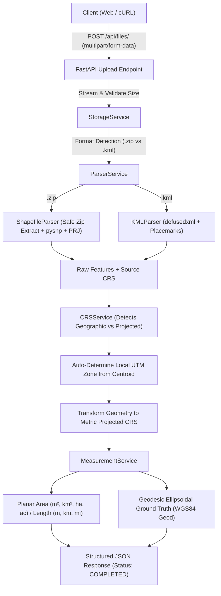

# Geospatial File Measurement API

A production-ready, high-performance RESTful API built with **FastAPI**, **uv**, **Shapely**, and **PyProj** that accepts geospatial files (**ESRI Shapefiles** and **KML**), parses vector features, dynamically transforms geographic coordinates into optimal projected metric coordinate systems, and calculates precise geometric measurements (area, length, perimeter) with multi-unit conversions.

[](https://www.python.org/downloads/)
[](https://fastapi.tiangolo.com)
[](https://github.com/astral-sh/uv)
[](https://pytest.org)
[](LICENSE)

---

## 📌 Repository Link
**GitHub Repository**: [https://github.com/yaswanthsetty/Geospatial-File-Measurement-API.git](https://github.com/yaswanthsetty/Geospatial-File-Measurement-API.git)

---

## Table of Contents
- [Problem Statement](#-problem-statement)
- [Key Features](#-key-features)
- [Architecture & Application Structure](#-architecture--application-structure)
  - [Directory Layout](#directory-layout)
  - [System Flow Diagrams](#system-flow-diagrams)
- [CRS Handling & Projection Strategy](#-crs-handling--projection-strategy)
- [API Reference](#-api-reference)
  - [Interactive Swagger / OpenAPI Docs](#interactive-swagger--openapi-docs)
  - [Endpoints Summary](#endpoints-summary)
  - [Endpoint Details & Examples](#endpoint-details--examples)
- [Installation & Quick Start (uv)](#-installation--quick-start-uv)
  - [Prerequisites](#prerequisites)
  - [Setup Instructions](#setup-instructions)
  - [Running the Server](#running-the-server)
  - [Running Tests](#running-tests)
- [Design Decisions & Alternatives Considered](#-design-decisions--alternatives-considered)
- [Learnings & Future Scope](#-learnings--future-scope)

---

## 🎯 Problem Statement
Geospatial files often store geometry features in geographic coordinate systems (such as **WGS 84 / EPSG:4326**) where coordinates are expressed in angular degrees (latitude and longitude). Directly computing Euclidean areas or lengths using degree units leads to severe spatial distortion and invalid measurements because:
1. $1^\circ$ of latitude is approximately $\approx 111\text{ km}$, while $1^\circ$ of longitude scales with $\cos(\text{latitude})$ (shrinking to $0\text{ km}$ at the poles).
2. Calculating $\text{degrees} \times \text{degrees}$ produces $\text{deg}^2$, which cannot represent real-world metric areas.

This service solves that challenge by accepting geospatial files (**Shapefile .zip** and **KML .kml**), parsing features, extracting source CRS, auto-projecting geographic geometries into the optimal metric **Universal Transverse Mercator (UTM)** zone, and computing accurate planar and geodesic measurements.

---

## 🚀 Key Features
- **Multi-Format Ingestion**:
  - **ESRI Shapefile**: Upload `.zip` containing `.shp`, `.shx`, `.dbf`, and `.prj`.
  - **KML (Keyhole Markup Language)**: Upload `.kml` containing Placemarks, styles, coordinates, and `<ExtendedData>`.
- **Intelligent CRS Management**:
  - Automatically identifies geographic vs. projected Coordinate Reference Systems.
  - Automatically computes the centroid and projects features to the exact local **Universal Transverse Mercator (UTM)** zone or **Universal Polar Stereographic (UPS)** for polar regions.
  - Computes ground-truth **Geodesic Ellipsoidal measurements** using `pyproj.Geod(ellps="WGS84")`.
- **Accurate Metric Calculations**:
  - **Polygon / MultiPolygon**: Area ($m^2$, $km^2$, hectares, acres) and boundary perimeter ($m$).
  - **LineString / MultiLineString**: Length (meters, kilometers, miles).
  - **Point / MultiPoint**: Gracefully identified without crashing (`status: "SKIPPED_UNSUPPORTED"`).
  - **GeometryCollection**: Recursively evaluates composite parts.
- **Security-First Processing**:
  - **Zip Slip protection**: Strict validation that zip extraction paths stay inside target sandboxes.
  - **XXE / XML Bomb protection**: Uses `defusedxml` to prevent XML entity expansion attacks.
  - Max upload size enforcement (configurable, default 50MB).
- **Fast & Modern Stack**:
  - Powered by **uv** for sub-second virtualenv resolution and execution.
  - OpenAPI 3.1 & Swagger interactive documentation out of the box.
  - 31 automated unit and integration tests passing.

---

## 🏗 Architecture & Application Structure

### Directory Layout
```
Geospatial-File-Measurement-API/
├── app/
│   ├── __init__.py
│   ├── main.py                     # FastAPI application setup, middleware, lifecycle & routing
│   ├── core/
│   │   ├── __init__.py
│   │   ├── config.py               # Pydantic Settings (upload limits, storage paths, extensions)
│   │   └── exceptions.py           # Custom exception hierarchy & standard HTTP error mapping
│   ├── models/
│   │   ├── __init__.py
│   │   └── schemas.py              # Pydantic v2 data models for files, measurements & GeoJSON
│   ├── services/
│   │   ├── __init__.py
│   │   ├── crs_service.py          # CRS parsing, UTM projection selection, transformations, Geod
│   │   ├── measurement_service.py  # Area, length, perimeter, multi-unit conversions, summary aggregations
│   │   ├── parsers/
│   │   │   ├── __init__.py
│   │   │   ├── shapefile_parser.py # Safe extraction and parsing of zipped Shapefiles (.shp, .dbf, .prj)
│   │   │   └── kml_parser.py       # Defused XML parsing of KML features, geometries, attributes
│   │   ├── parser_service.py       # Unified router coordinating parser selection and measurement pipeline
│   │   └── storage_service.py      # Storage manager for file uploads, persistence, retrieval & cleanup
│   └── api/
│       ├── __init__.py
│       └── routers/
│           ├── __init__.py
│           ├── files.py            # Endpoints: POST /api/files/, GET /api/files/{id}/, measurements, features
│           └── health.py           # Health check endpoint: GET /api/health
├── samples/                        # Real-world test sample datasets
│   ├── sample_polygon.kml          # San Francisco Golden Gate Park polygon
│   ├── sample_linestring.kml       # Golden Gate Bridge path
│   ├── sample_mixed.kml            # Mixed Polygons, LineStrings, and Points
│   ├── sample_parcels.zip          # ESRI Shapefile with EPSG:4326 PRJ
│   └── sample_projected_parcels.zip# ESRI Shapefile in projected UTM Zone 43N (EPSG:32643)
├── scripts/
│   └── create_samples.py           # Reproducible script to generate sample datasets
├── tests/
│   ├── __init__.py
│   ├── test_crs.py                 # Unit tests for CRS detection & UTM projections
│   ├── test_measurements.py        # Unit tests for area/length calculation & graceful handling
│   ├── test_parsers.py             # Unit tests for Shapefile and KML parsing
│   └── test_api.py                 # Integration tests for FastAPI endpoints
├── pyproject.toml                  # Project metadata & dependencies managed by uv
├── uv.lock                         # Exact reproducible dependency lockfile
├── .gitignore                      # Git ignore rules
└── README.md                       # Comprehensive project documentation
```

### System Flow Diagrams

#### 1. Ingestion & Processing Pipeline


---

## 🌐 CRS Handling & Projection Strategy

### The Geographic Problem
Geographic coordinates (such as **WGS 84 / EPSG:4326**) represent angular degrees on the Earth's reference ellipsoid. A degree difference in longitude at the equator covers approximately $111.32\text{ km}$, but at $60^\circ$ latitude it only covers $55.8\text{ km}$, converging to $0\text{ km}$ at the poles. Therefore, performing direct Euclidean calculations ($x \times y$ or $\sqrt{\Delta x^2 + \Delta y^2}$) in degrees produces geometrically meaningless results.

### The Solution: Local UTM Projection Strategy
When geographic coordinates are detected:
1. **Centroid Extraction**: The feature's geometric centroid is computed in longitude $(\lambda)$ and latitude $(\phi)$.
2. **Polar Boundary Check**:
   - If latitude $\phi > 84^\circ$: Projected to **Universal Polar Stereographic North** (`EPSG:32661`).
   - If latitude $\phi < -80^\circ$: Projected to **Universal Polar Stereographic South** (`EPSG:32761`).
3. **UTM Zone Computation**:
   $$\text{Zone} = \left\lfloor\frac{\lambda + 180^\circ}{6^\circ}\right\rfloor + 1 \quad (\text{clamped between } 1 \text{ and } 60)$$
   $$\text{EPSG Code} = \begin{cases} 32600 + \text{Zone} & \text{if } \phi \ge 0^\circ \text{ (Northern Hemisphere)} \\ 32700 + \text{Zone} & \text{if } \phi < 0^\circ \text{ (Southern Hemisphere)} \end{cases}$$
4. **Vectorized Coordinate Transformation**: The geometry is transformed from EPSG:4326 into this local UTM projection using `pyproj.Transformer` with `always_xy=True` and vectorized coordinate mapping in Shapely 2.0. In UTM, coordinates are in true planar meters.
5. **Dual-Engine Geodesic Calculation**: In addition to planar projected measurements, the API computes the exact **geodesic surface area and length** directly along the WGS84 ellipsoid using `pyproj.Geod(ellps="WGS84")`. This provides users with both planar projected and ellipsoidal ground-truth metrics.

---

## 📡 API Reference

### Interactive Swagger / OpenAPI Docs
Once the application is running, visit:
- **Swagger UI**: [http://127.0.0.1:8000/docs](http://127.0.0.1:8000/docs)
- **ReDoc**: [http://127.0.0.1:8000/redoc](http://127.0.0.1:8000/redoc)
- **OpenAPI Schema**: [http://127.0.0.1:8000/openapi.json](http://127.0.0.1:8000/openapi.json)

### Endpoints Summary

| Method | Endpoint | Description |
|---|---|---|
| `POST` | `/api/files/` | Uploads and processes a `.zip` (Shapefile) or `.kml` file. |
| `GET` | `/api/files/` | Lists all uploaded and processed files. |
| `GET` | `/api/files/{id}/` | Retrieves metadata and status for a specific file. |
| `GET` | `/api/files/{id}/measurements/` | Retrieves calculated measurements for all features in the file. |
| `GET` | `/api/files/{id}/features/` | Retrieves features in standard GeoJSON FeatureCollection format. |
| `DELETE` | `/api/files/{id}/` | Deletes a file record and its saved disk artifacts. |
| `GET` | `/api/health` | Health check and service status. |

---

### Endpoint Details & Examples

#### 1. Upload File
**`POST /api/files/`**

Uploads a `.zip` Shapefile or `.kml` file. The server processes features and computes measurements immediately.

**Example Request:**
```bash
curl -X POST "http://127.0.0.1:8000/api/files/" \
  -H "accept: application/json" \
  -F "file=@samples/sample_polygon.kml"
```

**Example Response (201 Created):**
```json
{
  "id": "c7a88b1f7b7f",
  "filename": "sample_polygon.kml",
  "file_type": "KML",
  "feature_count": 1,
  "crs": "EPSG:4326",
  "status": "COMPLETED",
  "uploaded_at": "2026-10-09T11:15:30.123456Z",
  "error_message": null
}
```

---

#### 2. Get File Information
**`GET /api/files/{id}/`**

Retrieves metadata and processing status for an uploaded file.

**Example Request:**
```bash
curl -X GET "http://127.0.0.1:8000/api/files/c7a88b1f7b7f/"
```

**Example Response (200 OK):**
```json
{
  "id": "c7a88b1f7b7f",
  "filename": "sample_polygon.kml",
  "file_type": "KML",
  "feature_count": 1,
  "crs": "EPSG:4326",
  "status": "COMPLETED",
  "uploaded_at": "2026-10-09T11:15:30.123456Z",
  "error_message": null
}
```

---

#### 3. Get File Measurements
**`GET /api/files/{id}/measurements/`**

Returns calculated measurements for features in the file, including planar area/length across multiple units, boundary perimeter, projected CRS applied, and geodesic references.

**Example Request:**
```bash
curl -X GET "http://127.0.0.1:8000/api/files/c7a88b1f7b7f/measurements/"
```

**Example Response (200 OK):**
```json
{
  "file_id": "c7a88b1f7b7f",
  "filename": "sample_polygon.kml",
  "summary": {
    "total_features": 1,
    "measured_features": 1,
    "skipped_features": 0,
    "total_area_sq_meters": 1391500.5,
    "total_area_sq_kilometers": 1.391501,
    "total_area_hectares": 139.15005,
    "total_length_meters": 0.0,
    "total_length_kilometers": 0.0
  },
  "measurements": [
    {
      "feature_id": "park_1",
      "geometry_type": "Polygon",
      "measurement_type": "area",
      "supported": true,
      "status": "SUCCESS",
      "message": "Area calculated successfully in projected metric CRS.",
      "source_crs": "EPSG:4326",
      "projected_crs": "EPSG:32610 (WGS 84 / UTM zone 10N)",
      "area": {
        "area_sq_meters": 1391500.5,
        "area_sq_kilometers": 1.391501,
        "area_hectares": 139.15005,
        "area_acres": 343.847,
        "perimeter_meters": 6120.35
      },
      "length": null,
      "geodesic": {
        "geodesic_area_sq_meters": 1390450.2,
        "geodesic_length_meters": null
      },
      "properties": {
        "name": "Golden Gate Park Demo Parcel",
        "description": "Urban park parcel in San Francisco, CA",
        "zone": "Recreational",
        "jurisdiction": "San Francisco"
      }
    }
  ]
}
```

---

#### 4. Get File Features (GeoJSON)
**`GET /api/files/{id}/features/`**

Returns features in standard GeoJSON `FeatureCollection` format for easy integration into Leaflet, Mapbox, or QGIS.

**Example Request:**
```bash
curl -X GET "http://127.0.0.1:8000/api/files/c7a88b1f7b7f/features/"
```

**Example Response (200 OK):**
```json
{
  "type": "FeatureCollection",
  "file_id": "c7a88b1f7b7f",
  "features": [
    {
      "type": "Feature",
      "id": "park_1",
      "geometry": {
        "type": "Polygon",
        "coordinates": [
          [
            [-122.4862, 37.7694],
            [-122.4530, 37.7712],
            [-122.4542, 37.7665],
            [-122.4875, 37.7648],
            [-122.4862, 37.7694]
          ]
        ]
      },
      "properties": {
        "name": "Golden Gate Park Demo Parcel",
        "zone": "Recreational"
      }
    }
  ]
}
```

---

## ⚡ Installation & Quick Start (uv)

### Prerequisites
- **Python 3.12+**
- **uv** package manager installed ([https://github.com/astral-sh/uv](https://github.com/astral-sh/uv))
  - Install uv on Windows: `powershell -c "irm https://astral.sh/uv/install.ps1 | iex"`
  - Install uv on macOS / Linux: `curl -LsSf https://astral.sh/uv/install.sh | sh`

### Setup Instructions
1. **Clone the repository**:
   ```bash
   git clone https://github.com/yaswanthsetty/Geospatial-File-Measurement-API.git
   cd Geospatial-File-Measurement-API
   ```

2. **Synchronize virtual environment and dependencies**:
   ```bash
   uv sync
   ```

3. **Generate Sample Files (Optional)**:
   ```bash
   uv run python scripts/create_samples.py
   ```

### Running the Server
Start the development server with live reload:
```bash
uv run uvicorn app.main:app --host 127.0.0.1 --port 8000 --reload
```
The server will be available at: `http://127.0.0.1:8000`

### Running Tests
Execute the full test suite with verbose reporting:
```bash
uv run pytest -v
```

---

## 🧠 Design Decisions & Alternatives Considered

| Decision | Selected Approach | Alternative Considered | Rationale |
|---|---|---|---|
| **Framework** | **FastAPI** | Django + DRF | FastAPI provides native async I/O, automatic Pydantic v2 data validation, built-in interactive Swagger UI, and significantly faster response times without the heavy ORM overhead required by Django. |
| **Package Manager** | **uv** | pip / poetry / pipenv | `uv` resolves and installs Python wheels in milliseconds, generates deterministic lockfiles (`uv.lock`), and avoids environment conflicts across platforms. |
| **Geospatial Processing Engine** | **Shapely 2.x + PyProj 3.8 + PyShp** | Full GDAL / Fiona C-stack | Heavy GDAL C-libraries frequently suffer from compilation errors, wheel mismatches, and native runtime dependency headaches on Windows. `Shapely 2.x` and `PyProj` bundle optimized C-GEOS/PROJ binaries, while `pyshp` and `defusedxml` provide 100% reliable, pure-Python parsing for Shapefiles and KML. |
| **Projection Selection Strategy** | **Dynamic Centroid UTM Zone + WGS84 Geod** | Web Mercator (EPSG:3857) or Static Projection | Web Mercator introduces extreme area distortions (over 100% inflation at high latitudes). The local UTM projection preserves conformal shapes and minimizes planar distortion to $<0.1\%$. The addition of WGS84 `Geod` gives exact ellipsoidal reference measurements. |
| **XML Security** | **`defusedxml`** | Standard `xml.etree` | Standard XML parsers are vulnerable to Billion Laughs (XML entity expansion) and external entity injection (XXE). `defusedxml` hardens against all untrusted user-uploaded XML payloads. |
| **Storage Architecture** | **Atomic Local File System & JSON Index** | Relational Database (PostgreSQL/PostGIS) | Keeps deployment self-contained with zero external database configuration needed for local evaluation, while maintaining clean separation of concerns for plug-and-play PostgreSQL/S3 adaptation. |

---

## 🎓 Learnings & Future Scope

### Key Learnings
1. **Geodesic vs. Planar Projection Differences**: Observed the real-world mathematical difference between conformal local projections (UTM) and ellipsoidal geodesics (`pyproj.Geod`). Planar projections are ideal for high-speed cartographic calculation, while ellipsoidal formulas provide invariant ground truth.
2. **KML Namespace Inconsistencies**: KML documents in the wild frequently change default XML namespaces (`kml/2.2`, `kml/2.1`, `gx:`). Stripping namespace prefixes dynamically ensures fault-tolerant Placemark and coordinate ingestion.
3. **Zip Slip Vulnerability Vectors**: Unpacking untrusted zip archives requires explicitly validating resolved canonical paths against target directories to prevent path traversal.

### Future Scope & Enhancements
- [ ] **Background Worker Queue**: Integrate **Celery** or **ARQ** with Redis for asynchronous background processing of multi-gigabyte shapefiles.
- [ ] **Expanded Format Support**: Add support for **GeoJSON**, **GeoPackage (.gpkg)**, **FlatGeobuf**, and **GeoParquet**.
- [ ] **Raster & Elevation (DEM)**: Accept GeoTIFF raster digital elevation models to compute true 3D surface area incorporating topographic slope.
- [ ] **Spatial Indexing & Querying**: Add R-tree / GeoPandas spatial indexing to query features by bounding box or radius (`/api/files/{id}/search?bbox=...`).
- [ ] **Docker Containerization**: Provide a multi-stage `Dockerfile` and `docker-compose.yml` for single-command production deployment.

---

## 📄 License
This project is licensed under the MIT License.

